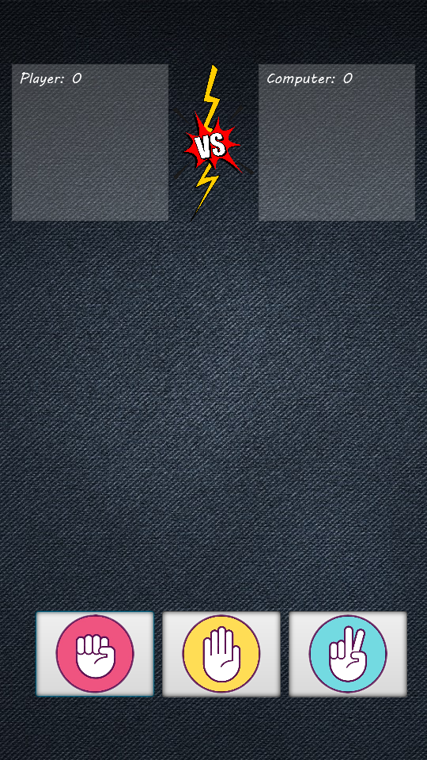
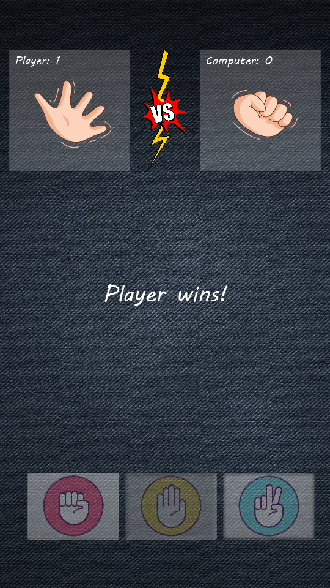
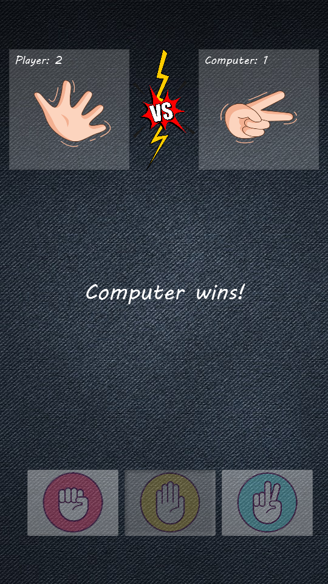
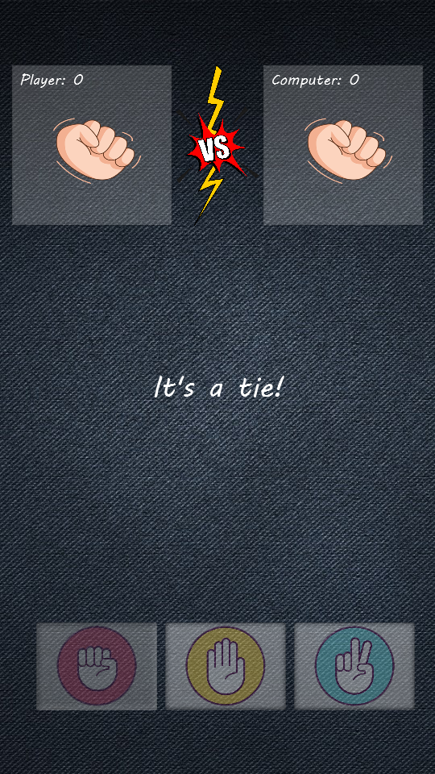
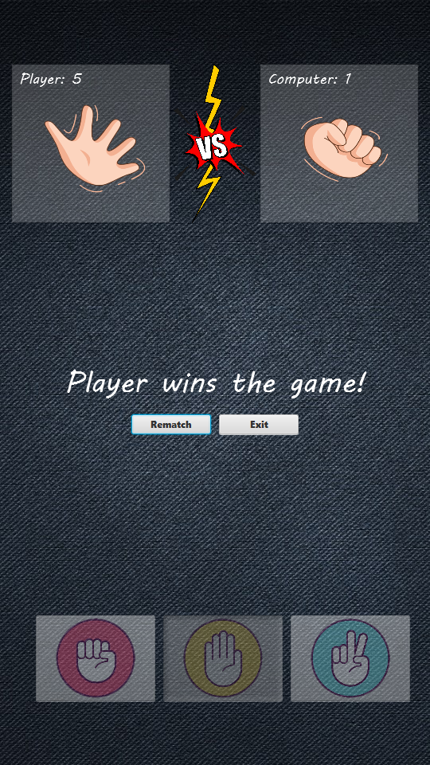
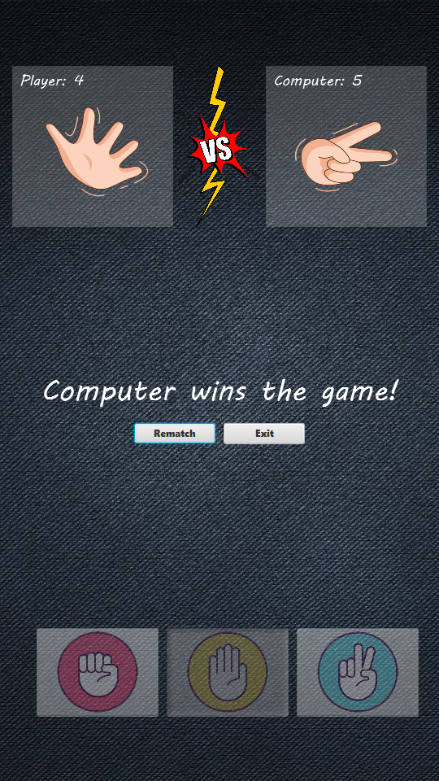

# Rock-Paper-Scissors Game 🎮

Welcome to the **Rock-Paper-Scissors** game! This is a fun and interactive game where you can challenge the computer to a classic match of Rock, Paper, Scissors. The first to score 5 points wins the game!

---

## 🖥️ Features
- **Interactive Gameplay**: Choose between Rock, Paper, or Scissors and see the results instantly.
- **Score Tracking**: Keep track of your score and the computer's score.
- **Dynamic Visuals**: Watch the images update based on your choices.
- **End Game Options**: Play a rematch or exit the game when someone wins.

---

## 🚀 How to Run
1. Ensure you have **JavaFX** installed on your system.
2. Clone this repository:
   ```bash
   git clone https://github.com/your-repo/RPS.git
   ```
3. Navigate to the project directory:
   ```bash
   cd RPS
   ```
4. Compile the application:
   ```bash
   javac -cp "path-to-javafx-lib/*" src/*.java
   ```
5. Run the application:
   ```bash
   java -cp "path-to-javafx-lib/*:src" App
   ```

---

## 🎮 How to Play
1. Launch the game.
2. Click on one of the buttons:
   - **Rock**
   - **Paper**
   - **Scissors**
3. The computer will randomly choose its move.
4. The winner of the round will be displayed.
5. The first to score **5 points** wins the game!

---

## 📂 Project Structure
```
RPS/
├── res/                # Resources (images, background, etc.)
├── src/                # Source code
│   ├── App.java        # Main application entry point
│   ├── Controller.java # Game logic and UI interactions
│   ├── GameLogic.java  # Core game logic
│   └── Main.fxml       # UI layout
└── README.md           # Project documentation
```

---

## 🖼️ Screenshots
### Main Screen


### Gameplay Outcomes
<table>
  <tr>
    <td><b>Player Wins</b></td>
    <td><b>Computer Wins</b></td>
    <td><b>Draw</b></td>
  </tr>
  <tr>
    <td></td>
    <td></td>
    <td></td>
  </tr>
</table>

### Winning Screen
<table>
  <tr>
    <td><b>Player Wins the Game</b></td>
    <td><b>Computer Wins the Game</b></td>
  </tr>
  <tr>
    <td></td>
    <td></td>
  </tr>
</table>

---

## 🛠️ Technologies Used
- **JavaFX**: For building the user interface.
- **Java**: Core programming language.

---

## 🤝 Contributing
Contributions are welcome! Feel free to fork the repository and submit a pull request.

---

## 📜 License
This project is licensed under the [MIT License](LICENSE).

---

## 💡 Acknowledgments
- Background and button images sourced from free online resources.
- Inspired by the classic Rock-Paper-Scissors game.

Enjoy the game and have fun! 🎉
